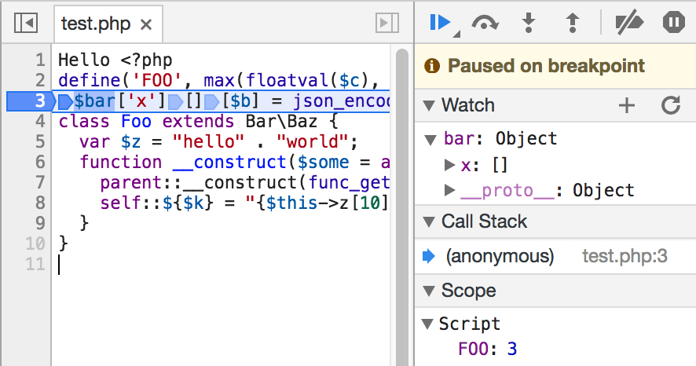

# PHP7 to ES7 syntax translator

This project transpiles PHP source code to readable JavaScript source code.

The conversion is implemented as an AST to AST translation (with source maps!). Produced code will have valid JavaScript syntax, but may not work quite the same way due to many conceptual differences between the languages.

<table><tr><th>PHP input &rarr;</th><th>&rarr; generated JS</th></tr><tr><td><pre>
define('FOO', max(floatval($c), strlen("foo")));
$bar['x'][][$b] = json_encode(__FILE__);
class Foo extends Bar\Baz {
  var $z = "hello" . "world";
  function __construct($some = array(7)) {
    parent::__construct(func_get_args());
    self::${$k} = "{$this->z[10]}";
  }
}</pre></td><td><pre>
const FOO = Math.max(+c, "foo".length);
bar.x.push({[b]: JSON.stringify(__filename)});
class Foo extends Bar.Baz {
  constructor(some = [7]) {
    super(arguments);
    this.z = "hello" + "world";
    this.constructor[k] = `${this.z[10]}`;
  }
}</pre></td></tr></table>

## Usage

You must have Node.js 7 or later. This is a [Babel](https://babeljs.io/) preset. Install it with `npm i -S babel-preset-php`. Configure it the same way you'd configure other presets such as `es2015`. For example, set `.babelrc` to:

```json
{
  "presets": ["php"]
}
```

and then convert files with Babel as usual, e.g:

```sh
npm i -g babel-cli
babel file.php -o file.js
```

## Supported language features

Almost all of PHP 7 syntax is supported. Most constructs do vaguely what you'd expect.

  * Expressions, control statements, try/catch, functions, closures.
  * Classes, with some caveats.
    * Private methods and properties aren't private.
    * Class constants are not constant.
    * Static class properties use ES7 syntax.
  * Some common simple functions like `strlen`, `array_pop`, and `is_bool` are translated to JS equivalents. For more complex functions, see [Locutus](https://github.com/kvz/locutus).
  * Type hints are translated as [Flow annotations](https://www.npmjs.com/package/babel-plugin-transform-flow-strip-types).


### Supported, but not quite the same

  * PHP's arrays have many features that can't be easily expressed in JS.
    * PHP's `array()` is ambiguous in JS, because it could either be an associative `{}` or numeric `[]` array. Empty array is translated as `Array()`, so you can find and correct it.
    * `foreach` is translated as `for-of` or `for-in` loops. They are different in many subtle ways.
    * Mixing of integer and string keys in arrays is going to cause trouble. Forget about preserving order.
  * Namespaced names such as `Foo\Bar` are changed to `Foo.Bar` and it's up to you to make that work.
  * Global-global vs module-"global" scopes are incoherently mixed.
  * In JS `+` is ambiguous and type-sensitive, so you'll have lots of `2+2=22` errors. PHP string concatenation `.` is translated as `+`.
  * Variable-variables work only for globals. Don't use them anyway.
  * function-static variables are emulated as globals. Don't use them either.
  * PHP's `NULL` is semantically closer to `undefined`, and is translated as such.

### Unsupported language features

#### Could be improved. Pull requests welcome!

  * Exporting of items as modules.
  * Processing of comments.
  * Renaming of variable and property names colliding with reserved names, method names, etc.
  * Renaming of private methods and properties.
  * Re-parsing of assert.
  * Concat operator should ensure operands are strings, and `+` should cast to numbers.
  * Interfaces (could be translated to Flow types).
  * Type inference to fix `+`/`.` and `[]`/`{}` ambiguities.
  * Namespaces.
  * Autoloading and `include_path`. You'll need to manually fix `require()`.
  * "Magic" methods such as `__get`.

#### Not going to happen

  * Destructors.
  * References. `&$a` is translated as just `a`.
  * Copy-on-write arrays. In JS they're passed by reference.
  * Internal array pointers.
  * Error silencing `@`.

## Mismatch between Node.js and PHP

  * `$_POST[]`, `header()`, `echo` and other request/response dependent code. In Node.js these are not global.
  * Similarly, process-kiling `die()`/`exit()` are inappropriate in Node.js servers.
  * There isn't a class hierarchy for exceptions, and JS `Error` [can't be subclassed correctly](https://coderwall.com/p/m3-cqw/subclassing-error-in-javascript-is-harder-than-it-seems).


## Running PHP in the browser

  It works! You may need to add `var echo = document.write.bind(document); var global = window;` and patch a few other functions.



## Thanks

This project wouldn't happen without [ichiriac's PHP parser](https://www.npmjs.com/package/php-parser) and [Babel generator](https://www.npmjs.com/package/babel-generator).